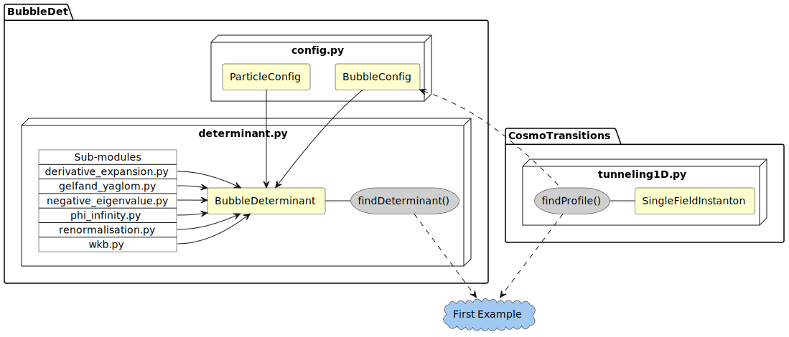

======================================
First example
======================================

As a first example use case for BubbleDet, let us consider a simple real scalar
model in 4d. A code to compute the nucleation rate for this model is outlined
below.

To start, we import the relevant libraries, and define the model by a tree-level
potential. We also define the first and second derivatives of the potential.

.. literalinclude:: ../../examples/first_example.py
   :language: py
   :lines: 8-36

For the values of the parameters we have chosen, the potential has a false
(metastable) minimum at :py:data:`phi_false`, and a true (stable) vacuum at
:py:data:`phi_true`.

We then use CosmoTransitions to solve for the bubble, or bounce, profile. Note
that it is important that the bounce is solved to high accuracy as numerical
errors propagate to the functional determinant. We also compute the tree-level
action evaluated on the bubble.

.. literalinclude:: ../../examples/first_example.py
  :language: py
  :lines: 39-53

This profile can then be used to construct a :py:data:`BubbleConfig` object,
which characterises the background field.

.. literalinclude:: ../../examples/first_example.py
  :language: py
  :lines: 55-56

Then, a :py:data:`ParticleConfig` object is constructed which characterises
the fluctuating particle, in this case the Higgs itself.

.. literalinclude:: ../../examples/first_example.py
  :language: py
  :lines: 58-64

These are then passed to construct a :py:data:`BubbleDeterminant` instance,
from which we can call all the major functionality of the `BubbleDet` package,
including the computation of the full functional determinant of scalar field
fluctuations in the background of the bubble.

.. literalinclude:: ../../examples/first_example.py
  :language: py
  :lines: 66-75

The variables :py:data:`S0` and :py:data:`S1` store the tree-level and one-loop
action for the bounce configuration, and :py:data:`S1_err` gives an estimate
for the numerical error in :py:data:`S1`.

Here is a component diagram showing how the different classes and packages
interacted in this first example.

|
