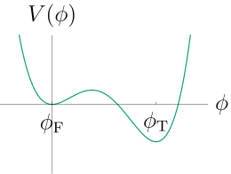

======================================
Introduction
======================================

Consider a scalar field :math:`\phi` in :math:`d` dimensions, with Euclidean
action

.. math::
    S = \int \mathup{d}^d x \left[
    \frac{1}{2}\nabla_\mu \phi \nabla_\mu \phi + V(\phi)
    \right] .

If the potential :math:`V` has a metastable vacuum,

then the decay rate,
:math:`\Gamma`, is given by\ :footcite:p:`Callan:1977pt`

.. math::
  \Gamma = \underbrace{\left( \frac{S[\phi_\text{b}]}{2\pi} \right)^{d/2}
  \left(\frac{\vert\det ' (- \Box + V''(\phi_\text{b}))\vert}{\det (- \Box + V''(\phi_\text{F}))}
  \right)^{-1/2}}_\text{prefactor}
  e^{-\left(S[\phi_\text{b}] - S[\phi_\text{F}]\right)} .

where :math:`\phi_\text{b}` is the inhomogeneous bubble, or bounce, profile,
and :math:`\phi_\text{F}` is the homogeneous metastable phase, or false vacuum.
BubbleDet can compute the prefactor term highlighted above. BubbleDet is applicable for
arbitrary potentials, and in any dimension up to seven. It can also compute
multi-particle functional determinants, which arise for example in
symmetry-breaking transitions.
There are several packages which focus on the computation of the exponential
factor in the nucleation rate, such as
CosmoTransitions\ :footcite:p:`Wainwright:2011kj`.

For further details of the physics and mathematics behind BubbleDet, see the
acommpanying paper,
BubbleDet: A Python package to compute functional determinants for bubble
nucleation\ :footcite:p:`Ekstedt:2023sqc`.

**********
References
**********

.. footbibliography::
